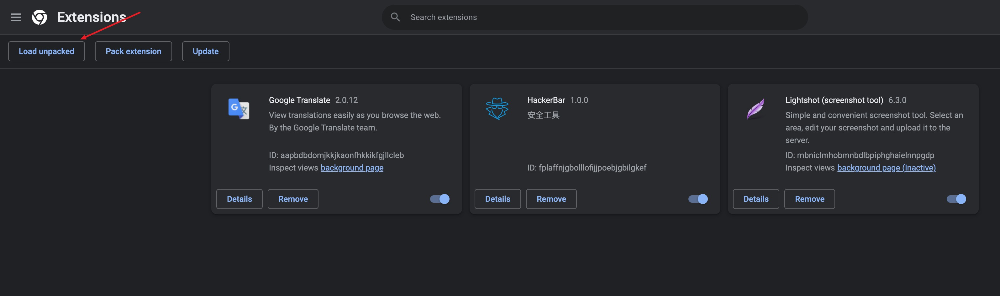
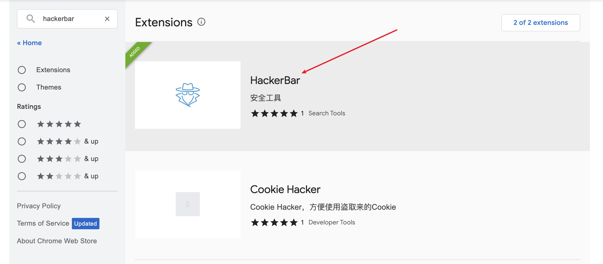
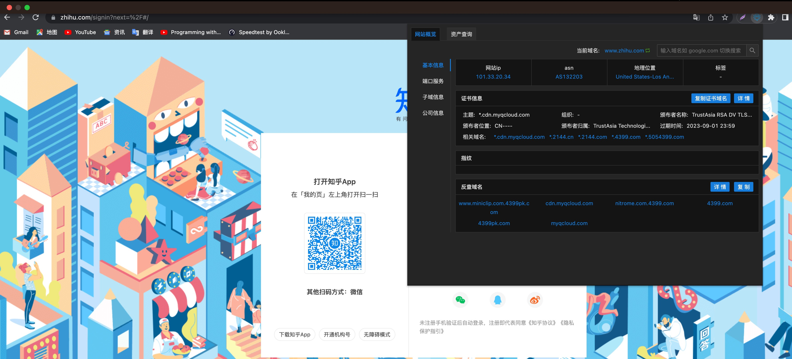
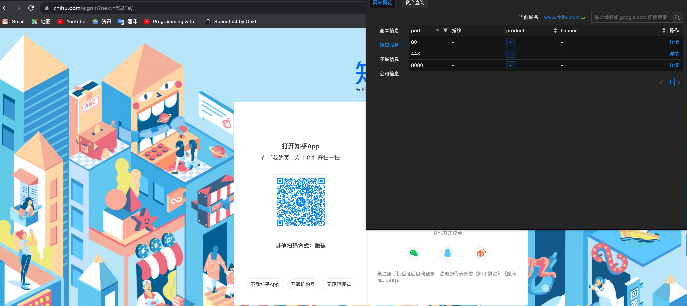
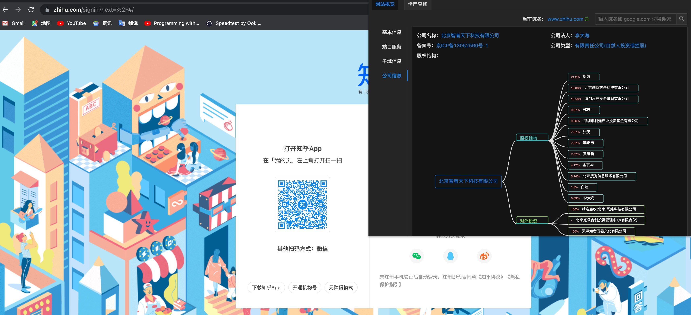
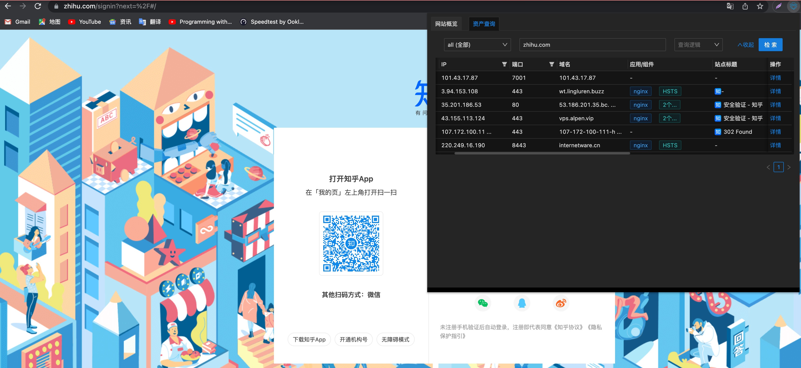

 
 <h2 align="center">HackerBar</h2>
 
An anonymous asset query tool

  

    
    
     
 

  

    <a href="https://github.com/HackerBar-Sec/HackerBar/issues/new/choose">Report Bug</a>
    ·
    <a href="https://github.com/HackerBar-Sec/HackerBar/discussions">Ask Question</a>
  

  

    <a href="README_EN.md">English</a>
    <a href="README.md">中文</a>
    

> HackerBar is an anonymous asset query tool, currently mainly listed on [Chrome](https://www.google.com/chrome/)。

Project Location：https://github.com/HackerBar-Sec/HackerBar

## Install

### Manual

Releases：https://github.com/HackerBar-Sec/HackerBar/releases

1.Download and Unzip

2.Open `chrome://extensions/` and Enable developer mode

3.Click `Load unpacked` select the plugin directory to load

### Chrome Web Store

1.Open the `https://chrome.google.com/webstore/category/extensions` to Chrome Web Store 

2.Search `hackerbar`

3.Add to Chrome

## Feature

### Basic Information

### Ports

### Company

### Cyberspace

